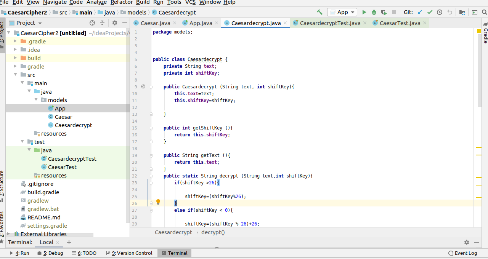
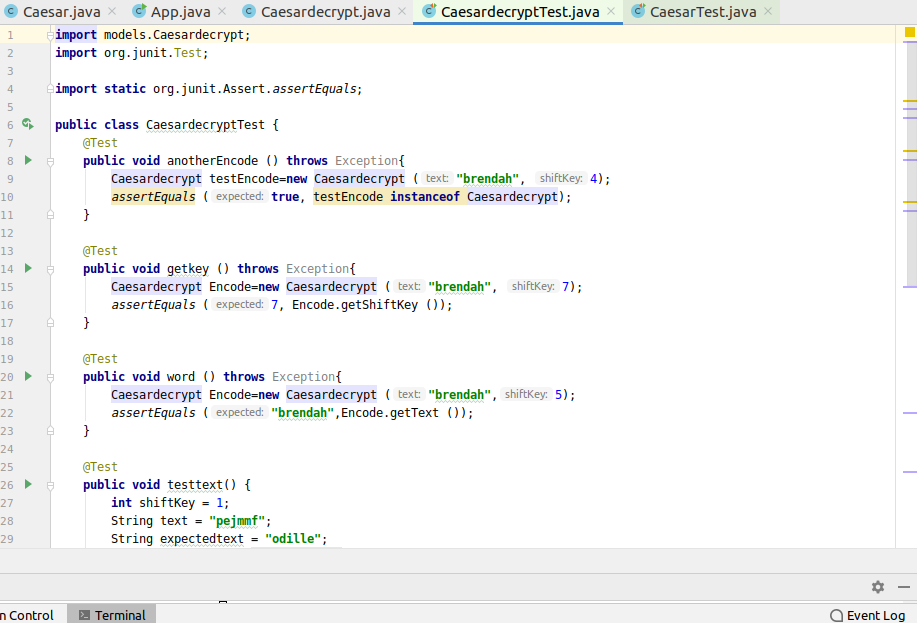
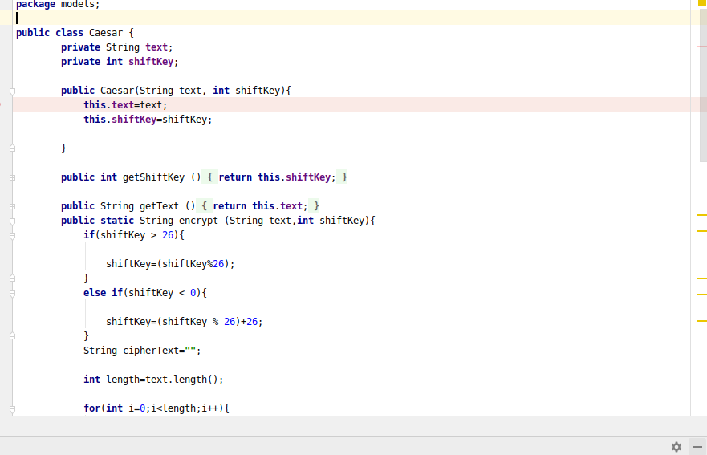
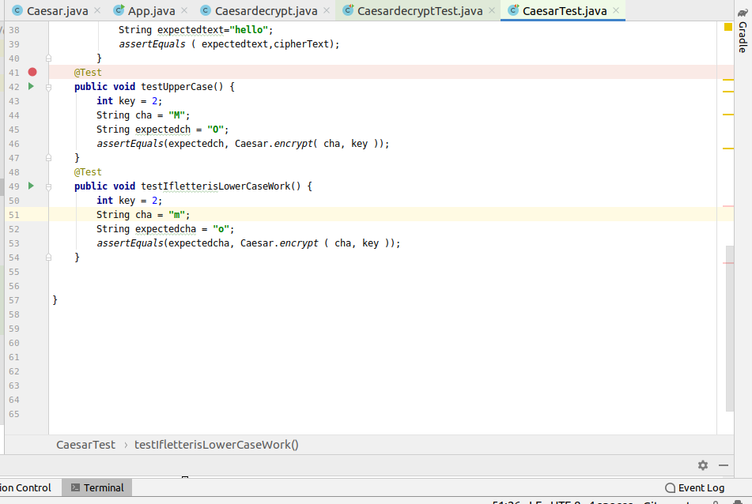
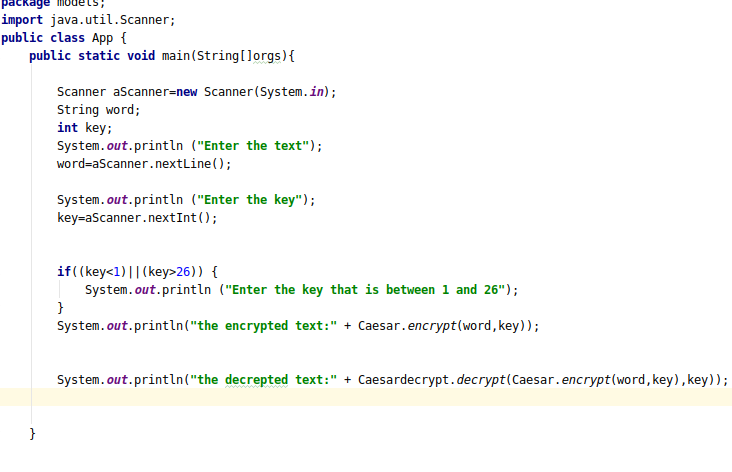

# CeaserCipher
## Author name:[Uwitonze brendah](https://github.com/brendahuwitonze)
## [CaesarCipher on github](https://github.com/brendahuwitonze/CaesarCipher)

### Description of the project
This is the application called ceaser cipher.The ceaser cipher application will allow the user to Enter the text with the key to change the the text in the encoded form and later he can change it to the normal form called decryption .The key is always a number which shows the number of characters thata use wants to change.
key is (1-26) and the character is (a-z or A-Z) 

# BDD
## Input
Enter the string;

chose the key;

## Output
Encrypted text;

Decrypted text;

## Tools used
Intellij
## Screenshot of codes

* Decrypt 

* DecryptTest

 * Ecrypt codes

* EcryptTest code

* App code

## License

The above copyright notice and this permission notice shall be included in all
copies or substantial portions of the Software.

THE SOFTWARE IS PROVIDED "AS IS", WITHOUT WARRANTY OF ANY KIND, EXPRESS OR
IMPLIED, INCLUDING BUT NOT LIMITED TO THE WARRANTIES OF MERCHANTABILITY, 
FITNESS FOR A PARTICULAR PURPOSE AND NONINFRINGEMENT. IN NO EVENT SHALL THE
AUTHORS OR COPYRIGHT HOLDERS BE LIABLE FOR ANY CLAIM, DAMAGES OR OTHER
LIABILITY, WHETHER IN AN ACTION OF CONTRACT, TORT OR OTHERWISE, ARISING FROM, 
OUT OF OR IN CONNECTION WITH THE SOFTWARE OR THE USE OR OTHER DEALINGS IN THE
SOFTWARE.}
Copyright (@) {2020} {UWITONZE BRENDAH}

